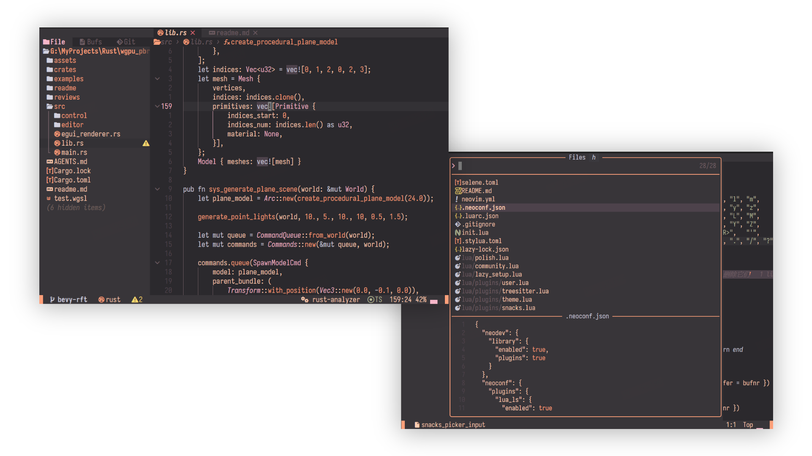
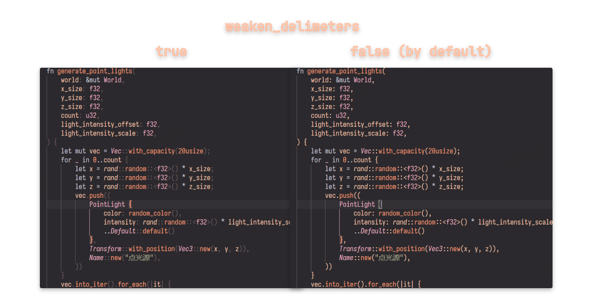

# ferra.nvim

A warm, earthy Neovim colorscheme built on top of the [catppuccin](https://github.com/catppuccin/nvim) architecture.

> **Ferra** is a single-flavour dark theme inspired by the [ferra](https://github.com/casperstorm/ferra) palette.



**Note** this project is migrated from catppuccin/nvim project by ai agent.

## Requirements

- [Neovim](https://neovim.io) >= 0.7.2
- True color support

## Installation

### [lazy.nvim](https://github.com/folke/lazy.nvim)

```lua
{ 
    "gloridifice/ferra.nvim", 
    name = "ferra", 
    priority = 1000, 
    config = function() 
        require("ferra").setup {
            -- you can setup here
        }
        vim.cmd.colorscheme "ferra"
    end, 
}
```

### [packer.nvim](https://github.com/wbthomason/packer.nvim)

```lua
use { "gloridifice/ferra.nvim", as = "ferra" }
```

## Usage

```lua
vim.cmd.colorscheme "ferra"
```

Or with configuration:

```lua
require("ferra").setup({
    flavour = "ferra", -- only flavour available
    transparent_background = false,
    term_colors = true,
    weaken_delimiters = false, -- true: change delimiters color from 'blush' to 'ash'
    styles = {
        comments = { "italic" },
        conditionals = { "italic" },
    },
    integrations = {
        blink_cmp = true,
        gitsigns = true,
        nvimtree = true,
        telescope = true,
        treesitter = true,
    },
})

vim.cmd.colorscheme "ferra"
```

## Palette

| Name         | Hex     | Usage                          |
|--------------|---------|--------------------------------|
| night        | #2b292d | background                     |
| ash          | #383539 | mantle, surface0               |
| umber        | #4d424b | surface1, selection            |
| bark         | #6F5D63 | overlay, comments, line numbers|
| mist         | #D1D1E0 | keywords, operators, sky       |
| sage         | #B1B695 | strings, green, teal           |
| blush        | #fecdb2 | text, rosewater                |
| coral        | #ffa07a | functions, constants, blue     |
| rose         | #F6B6C9 | types, pink, lavender          |
| ember        | #e06b75 | errors, red, maroon            |
| honey        | #F5D76E | warnings, yellow               |

## Integrations

Most catppuccin integrations are preserved. You can enable/disable them via the `integrations` table in setup.

## lualine

```lua
require("lualine").setup({
    options = { theme = "ferra" },
})
```

## barbecue

```lua
require("barbecue").setup({
    theme = "ferra",
})
```

## Config

- `weaken_delimiters`: true to make delimiters gray.



## Dev

Run `:FerraCompile` to reload ferra theme.

## Credits

- Original palette by [Casper Rogild Storm](https://github.com/casperstorm)
- Theme engine derived from [catppuccin/nvim](https://github.com/catppuccin/nvim)
- AI coding agent: [OpenCode](https://github.com/anomalyco/opencode)
- Model: [Kimi 2.6](https://www.kimi.com/)

## License

[MIT](LICENSE.md)
